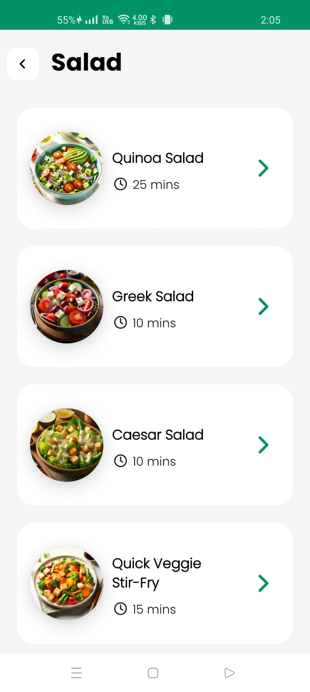
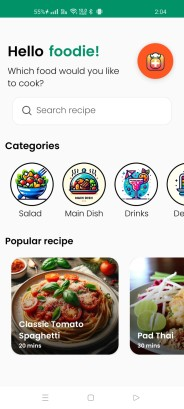
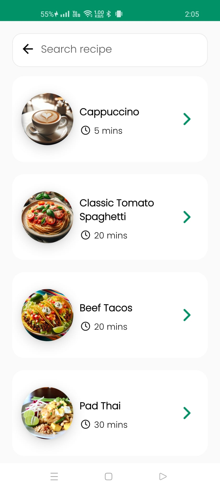

# VegTummy App

## Overview
VegTummy is a culinary treasure for vegetarians and vegan food enthusiasts, offering a user-friendly interface to explore, search, and upload a diverse range of plant-based recipes. From fresh salads to hearty main dishes and refreshing beverages, VegTummy provides a delightful cooking experience for every preference.

## Features
- **Categories**: Easily browse recipes sorted by categories such as Salad, Main Dish, Drinks, and Dessert.
- **Search Functionality**: Find exactly what you're craving with the responsive search feature.
- **Recipe Upload**: Share your culinary creations by uploading recipes with images and instructions.
- **Detailed View**: Get all the details for a successful cookout, including ingredients, estimated time, and cooking steps.
- **Interactive UI**: The app's design is both aesthetically pleasing and functional, promoting an engaging user experience.

## Screenshots

  

<!-- Home Screen with Categories and Popular Recipes -->

<!-- Search Results for Various Recipes -->

  <!-- Detailed Recipe View -->
  

## Tech Stack
- Android Studio
- Java
- Firebase Firestore for backend data storage
- Firebase Storage for image uploads

## Installation
To run the application:
1. Clone the repository.
2. Open the project in Android Studio.
3. Configure Firebase with the project.
4. Run the app on an emulator or a physical device.

## Developers
- Dor Mizrahi
- Adi Hershko
- Nir Katz

Their expertise and dedication have been instrumental in bringing VegTummy to life.

## Contributions
We encourage contributions! If you have ideas for improvement or new features, please fork the repository and submit a pull request.

## License
This project is licensed under the MIT License - see the LICENSE file for details.
